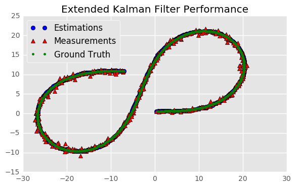

# Extended Kalman Filter Project Starter Code
Self-Driving Car Engineer Nanodegree Program

---

## Dependencies

* cmake >= 3.5
 * All OSes: [click here for installation instructions](https://cmake.org/install/)
* make >= 4.1
  * Linux: make is installed by default on most Linux distros
  * Mac: [install Xcode command line tools to get make](https://developer.apple.com/xcode/features/)
  * Windows: [Click here for installation instructions](http://gnuwin32.sourceforge.net/packages/make.htm)
* gcc/g++ >= 5.4
  * Linux: gcc / g++ is installed by default on most Linux distros
  * Mac: same deal as make - [install Xcode command line tools]((https://developer.apple.com/xcode/features/)
  * Windows: recommend using [MinGW](http://www.mingw.org/)

## Basic Build Instructions

1. Clone this repo.
2. Make a build directory: `mkdir build && cd build`
3. Compile: `cmake .. && make` 
   * On windows, you may need to run: `cmake .. -G "Unix Makefiles" && make`
4. Run it: `./ExtendedKF path/to/input.txt path/to/output.txt`. You can find
   some sample inputs in 'data/'.
    - eg. `./ExtendedKF ../data/obj_pose-laser-radar-synthetic-input.txt`

## Performance
The data file `obj_pose-laser-radar-synthetic-input.txt` was used as input and resulted in the
following RMSE values:

Accuracy - RMSE:
-----
- 0.0963513
- 0.0852071
- 0.415053
- 0.431299


## Visualization of performance


```python
# import plotly.offline as py
# from plotly.graph_objs import *
import pandas as pd
import math
# py.init_notebook_mode()

my_cols=['px_est','py_est','vx_est','vy_est','px_meas','py_meas','px_gt','py_gt','vx_gt','vy_gt']
with open('../../CarND-Extended-Kalman-Filter-Project-master/cmake-build-debug/out.txt') as f:
    table_ekf_output = pd.read_table(f, sep='\t', header=None, names=my_cols, lineterminator='\n')
    

import matplotlib.pyplot as plt
plt.style.use('ggplot')
%matplotlib inline

x1=table_ekf_output['px_est']
y1=table_ekf_output['py_est']

x2=table_ekf_output['px_meas']
y2=table_ekf_output['py_meas']

x3=table_ekf_output['px_gt']
y3=table_ekf_output['py_gt']

plt.plot(x1,y1,'bo',label='Estimations')
plt.plot(x2,y2,'r^',label='Measurements')
plt.plot(x3,y3,'g.',label='Ground Truth')

plt.legend(loc='upper left')

plt.title('Extended Kalman Filter Performance')
```


